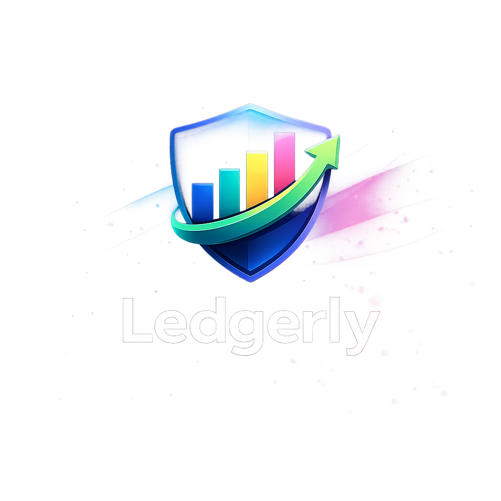
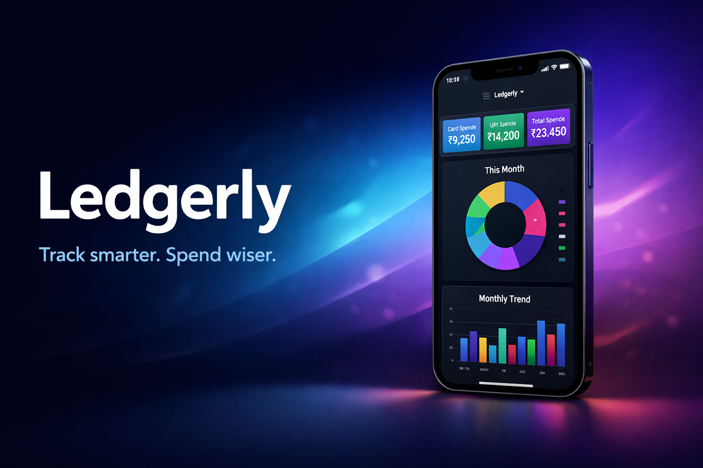

  

<h1 align="center">Ledgerly</h1>

  Track smarter. Spend wiser.

  
  
  

  

---

## 📱 App Preview

  
  
  

---

## ✨ Features

- ⚡ Quick expense entry
- 📊 Animated dashboard insights
- 💳 UPI vs Card spending analysis
- 📆 Monthly expense trends
- ☁️ Google Sheets as backend
- 🎨 Smooth animations

---

## 🎥 Animations

  

---

## 🧠 Architecture

  

---

## 🛠 Tech Stack

- Flutter & Dart
- Google Apps Script
- Google Sheets
- REST APIs
- fl_chart
- Riverpod & Hooks

---

## 🚀 Getting Started

1. Clone the repo
2. Set up Google Sheets template
3. Deploy Apps Script API
4. Add API URL to environment variables
5. Run the app

---

## 🔐 Security

- No credentials committed
- API URLs stored in env files
- Google Sheets access restricted

---

## 📜 License

MIT
